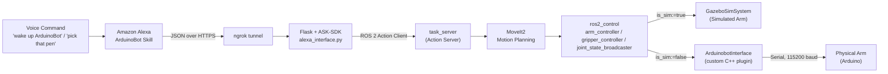

# Voice-Controlled Robotic Manipulator

A ROS 2 robotic arm that you can control with your voice — built to run identically in **simulation** (Gazebo + RViz + MoveIt2) and on a **physical Arduino-driven arm**, with **Amazon Alexa** as the voice interface for the real robot, and a custom **ros2_control hardware interface** bridging the two.


---

## What You're Seeing in the Demo

The clip above is split into three parts, each showing a different piece of the system in action:

| Panel | What it shows | Driven by |
|---|---|---|
| **Top (full width)** | The manipulator running in Gazebo, visualized in RViz, with the ROS 2 stack live in the terminal | **MoveIt2** motion planning, executed through simulation |
| **Bottom-left** | The physical arm executing the same pick task on real hardware | **Amazon Alexa** voice command, routed through ROS 2 and a custom hardware interface |
| **Bottom-right** | The Alexa Developer Console, showing the voice command being received and interpreted in real time | **ArduinoBot** Alexa Skill (Skill I/O + JSON trace) |

The point of pairing these three: the same task-execution logic drives the arm whether the command originates from a pre-programmed simulation run or from a live spoken instruction to Alexa — the voice interface sits on top of the same motion stack, it doesn't replace it. Swapping between simulation and real hardware is a single launch argument (`is_sim`), not a code change.

---

## Overview

This project implements a full voice-to-actuation pipeline for a robotic manipulator:

- A **URDF/xacro-modeled robot arm**, simulated in **Gazebo** and visualized in **RViz2**
- Motion planning and execution handled by **MoveIt2**, driven through **ros2_control**
- A **custom `ros2_control` hardware interface** (`ArduinobotInterface`), written in C++, that bridges `ros2_control`'s abstract joint command/state interfaces to a real Arduino over serial — built as a drop-in replacement for `gz_ros2_control`'s simulation plugin, so the exact same controllers, MoveIt2 config, and task-execution code run against either target
- A ROS 2 **action server** (`task_server`) that exposes high-level tasks (home, pick, rest) to any client
- A custom **Amazon Alexa Skill** ("**ArduinoBot**") that lets you control the arm with natural voice commands
- A bridge layer connecting Alexa's cloud-hosted voice recognition to the local ROS 2 graph, tunneled to the internet with **ngrok**
- A non-blocking Arduino firmware sketch that tracks per-joint targets independently, so multi-joint trajectories don't stall waiting on a single motor to finish moving

---

## System Architecture



**How a voice command becomes a movement:**

1. You speak a command to the Alexa Developer Console simulator (or an Alexa-enabled device) — e.g. *"wake up ArduinoBot"* or *"pick that pen."*
2. Alexa's NLU matches the utterance to one of three custom intents and sends a JSON request over HTTPS.
3. **ngrok** forwards that request from the public internet to a Flask server running locally.
4. The Flask app (built on Amazon's **ASK-SDK**) parses the intent and, running a ROS 2 node on a separate thread, sends a goal to the `task_server` **action server**.
5. `task_server` maps the requested task to a target — home position, pick position, or rest position — and hands it to **MoveIt2** for trajectory planning.
6. **ros2_control** executes the planned trajectory on the joint controllers. Depending on the `is_sim` launch argument, the trajectory is applied either to the Gazebo-simulated arm (`gz_ros2_control/GazeboSimSystem`) or to the physical Arduino-driven arm through the custom `ArduinobotInterface` plugin — same controller stack, same trajectory, different endpoint.
7. On real hardware, `ArduinobotInterface::write()` encodes each joint's target angle into a compact serial message (e.g. `b090,s045,e030,g000,`) and writes it to the Arduino; the Arduino's non-blocking firmware parses the message and steps each servo toward its target independently.

---

## Tech Stack

| Category | Technology |
|---|---|
| Robot framework | ROS 2 |
| Motion planning | MoveIt2 |
| Simulation | Gazebo |
| Visualization | RViz2 |
| Control | ros2_control (`arm_controller`, `joint_state_broadcaster`, `gripper_controller`) |
| Hardware abstraction | Custom `ros2_control` `SystemInterface` plugin (`ArduinobotInterface`), built with `pluginlib` and `hardware_interface` |
| Serial communication | `LibSerial` (C++), non-blocking custom Arduino firmware |
| Robot description | URDF / xacro |
| Voice assistant | Amazon Alexa (custom skill: **ArduinoBot**) |
| Voice ↔ ROS bridge | Python, Flask, Amazon ASK-SDK |
| Internet tunneling | ngrok |
| Concurrency | Python `threading` (Flask server + ROS 2 node running in parallel); C++ lifecycle-managed hardware interface |
| Hardware | Arduino-driven robotic arm (hobby servos) |
| Languages | Python, C++ |

---

## Features

- **Sim-to-real portability** — the exact same task-execution and control logic runs against the Gazebo simulation or the physical arm; only a launch-time argument (`is_sim`) and the `<hardware><plugin>` selection in the URDF change
- **Custom hardware interface** — a full `ros2_control::SystemInterface` implementation with proper lifecycle management (`on_init`, `on_activate`, `on_deactivate`, `read`, `write`), including automatic reconnection retries on activation for resilience against USB timing issues
- **Voice control via Alexa** — three custom intents:
  - **Wake** — brings the arm to its home position and opens the gripper
  - **Pick** — moves the arm to a pick position and closes the gripper
  - **Sleep** — returns the arm to a rest position
- **Graceful fallback handling** — an exception handler catches any unrecognized command and prompts the user to repeat it, rather than failing silently
- **Concurrent architecture** — the Alexa-facing Flask web server and the ROS 2 action client run in parallel threads, so voice requests can be received and processed without blocking the ROS 2 node
- **Non-blocking firmware** — the Arduino sketch tracks each joint's current and target position independently using `millis()`-based timing rather than blocking `delay()` calls, so the serial receive buffer never overflows while a multi-joint trajectory is executing
- **Full visualization** — RViz2 shows real-time robot state and planned trajectories alongside the Gazebo physics simulation
- **Action-based task execution** — tasks are exposed as a ROS 2 action (not a simple topic/service), enabling goal tracking and future extension to feedback/cancellation

---

## Repo Structure

```
voice-control-robot-manipulator/
├── arduinobot_description/     # URDF/xacro robot model, meshes, ros2_control hardware block
│   ├── urdf/
│   │   ├── arduinobot.urdf.xacro
│   │   ├── arduinobot_ros2_control.xacro   # <hardware> block: switches sim vs. real plugin on `is_sim`
│   │   └── arduinobot_gazebo.xacro
│   └── launch/
│       ├── display.launch.xml   # RViz-only, no simulation
│       └── gazebo.launch.xml
├── arduinobot_moveit/          # MoveIt2 configuration (planning groups, kinematics, RViz config)
│   ├── config/
│   │   ├── arduinobot.srdf              # planning groups: arduinobot_arm, arduinobot_hand
│   │   ├── kinematics.yaml
│   │   └── moveit_controllers.yaml
│   └── launch/moveit.launch.py
├── arduinobot_controller/      # ros2_control config + custom hardware interface plugin
│   ├── include/arduinobot_controller/
│   │   └── arduinobot_interface.hpp
│   ├── src/
│   │   └── arduinobot_interface.cpp   # Custom SystemInterface: serial bridge to real hardware
│   └── config/
│       └── arduinobot_controllers.yaml
├── arduinobot_firmware/        # Arduino sketch + standalone serial test nodes
│   ├── firmware/
│   │   └── robot_control/robot_control.ino   # Non-blocking multi-servo firmware, deployed to the Arduino
│   └── src/
│       ├── simple_serial_transmitter.cpp   # Standalone ROS 2 node used to bench-test the serial link
│       └── simple_serial_receiver.cpp
├── arduinobot_msgs/             # Custom action definition
│   └── action/
│       └── ArduinobotTask.action        # goal: task_number, result: success, feedback: percentage
├── arduinobot_remote/           # Task server (action server) + Alexa interface
│   ├── arduinobot_remote/
│   │   ├── task_server.py       # ROS 2 action server, drives MoveItPy
│   │   └── alexa_interface.py   # Flask + ASK-SDK bridge to ROS 2
│   └── launch/
│       └── remote_interface.launch.py
├── arduino_bringup/              # Top-level launch files tying everything together
│   └── launch/
│       └── simulated_robot.launch.py   # gazebo + controller + moveit + remote_interface, one command
└── README.md
```

---

## Alexa Skill Configuration

- **Skill name:** ArduinoBot
- **Invocation:** "wake up ArduinoBot" / "activate robot"
- **Model:** Custom, self-hosted endpoint (HTTPS via ngrok)

| Intent | Sample utterances | Robot behavior |
|---|---|---|
| **Wake** | "wake up the robot," "activate the robot," "wake up" | Moves to home position, opens gripper |
| **Pick** | "pick up this pen," "grab the pen," "pick that pen" | Moves to pick position, closes gripper |
| **Sleep** | "rest," "sleep," "turn off the robot" | Moves to rest position |

Alexa communicates with the local ROS 2 graph entirely through JSON requests over HTTPS, tunneled from the public internet to a local Flask server via **ngrok** — no cloud infrastructure beyond Alexa's own voice services and the tunnel is required.

---

## Engineering Challenges & Debugging

Getting a working simulation stack talking to real hardware surfaced a series of distinct problems, each requiring isolating the fault to a specific layer of the stack:

- **Sim/real interface mismatch** — `JointTrajectoryController` requires a `velocity` state interface to properly track and execute a trajectory; `gz_ros2_control`'s simulation plugin exposes this automatically for any interface declared in the URDF, but the custom `ArduinobotInterface` plugin had to explicitly export it, since it doesn't infer interfaces dynamically the way the simulation plugin does. Diagnosed by comparing `ros2_control`'s "discrepancy between URDF and exported HW interfaces" error against the interfaces actually being exported in code.
- **Serial buffer overflow on multi-joint commands** — an early, blocking version of the Arduino firmware used `delay()`-based stepping per joint, which meant the board stopped reading serial input entirely while one joint was mid-motion. Multi-joint trajectory commands arriving during that window were silently dropped or corrupted. Rewritten to track each joint's position and target independently and step them non-blockingly on every `loop()` iteration, checking for new serial input on every pass regardless of motion state.
- **USB device renumbering** — the Arduino's assigned device node (`/dev/ttyACM0`, `/dev/ttyACM1`, ...) shifts on every reconnect, breaking a hardcoded port path. Solved by referencing the board through its stable `/dev/serial/by-id/...` symlink (keyed to the device's USB serial number) instead of the raw, sequentially-assigned device name.
- **Silent activation failures on hardware reconnect** — the hardware interface's `on_activate()` originally attempted to open the serial port exactly once; a board still completing USB re-enumeration, or a stray process (e.g. a Serial Monitor session) holding the port, caused a hard failure with no recovery. Added a bounded retry loop with a short delay between attempts.
- **Open-loop position reporting** — standard hobby servos provide no real position feedback, so `read()` reports whatever was last commanded rather than a true measured state. This is an inherent hardware limitation (not a bug), and is called out explicitly in code comments and this README rather than silently assumed to be closed-loop.
- **ASK-SDK / OpenSSL 3 incompatibility** — a transitive dependency (`oscrypto`) fails to detect newer OpenSSL versions on current Linux distributions, breaking Alexa request signature verification at import time. Resolved by installing a specific upstream fix commit directly from source, since the corresponding release was never published.

---

## Future Improvements

- Add more granular voice commands (e.g. specifying which object to pick, or relative motion commands)
- Add visual/perception-based pick targeting instead of fixed predefined positions
- Extend the action server to report live feedback (e.g. "picking now...") back through Alexa during execution
- Add real position feedback (encoders) to close the control loop on the physical arm

---

## License

This project is licensed under the **MIT License**.
